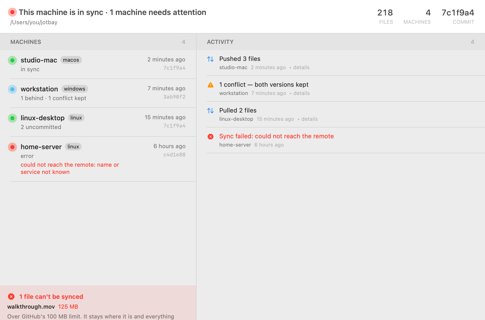
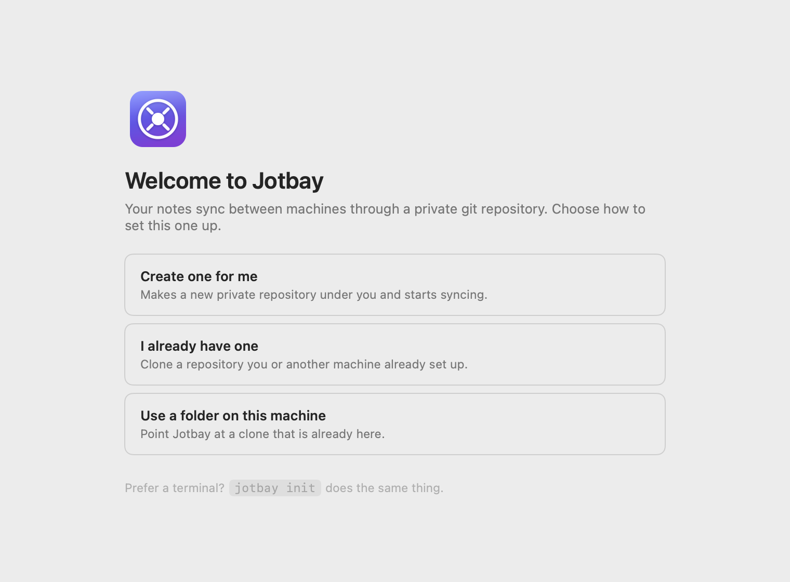
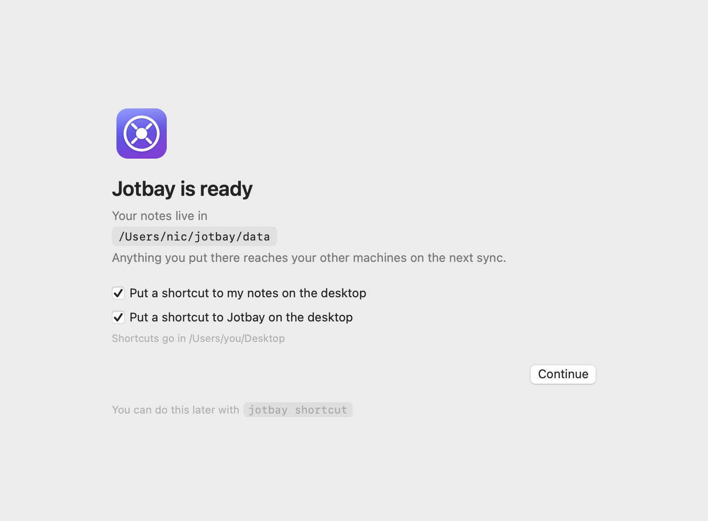
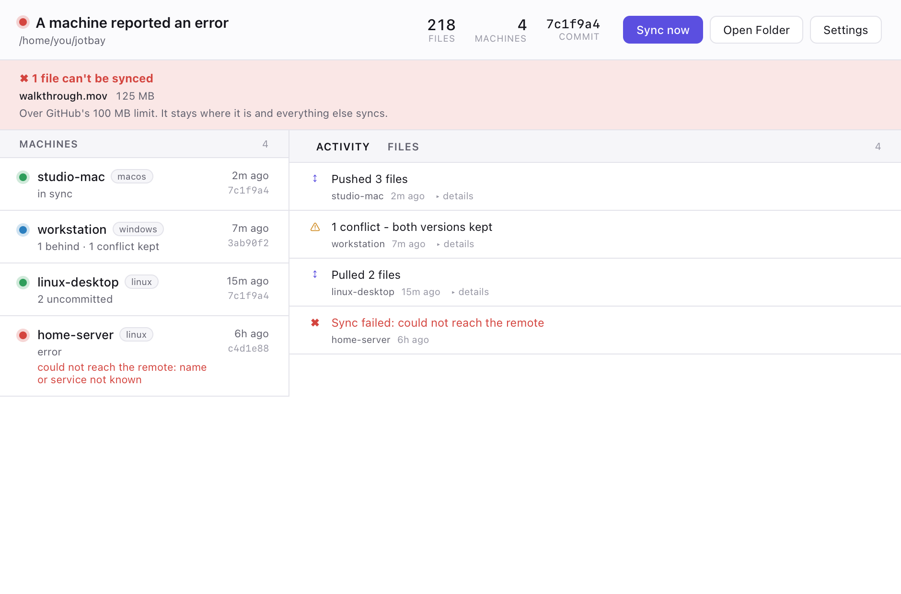

# Jotbay

Keep a folder of markdown notes in sync across every machine you use, through a
private git repository you own.

No server, no account, no telemetry. Your notes go to your remote and nowhere
else. **Conflicts keep both versions** — nothing you wrote is ever discarded to
resolve one.

Built for handing context to an AI assistant from whichever machine you happen
to be at, which is a use case that punishes silent data loss more than most.



*Every machine reports in. The one that has been failing for six hours says so
here, and in no commit log anywhere.*

---

## Install

**Download an installer** if you would rather not open a terminal — a notarized
`.dmg` for macOS, `-setup.exe` for Windows, `.deb` or `.AppImage` for
Linux, all on the [releases page](../../releases/latest). Open Jotbay and the
first screen asks where your notes should live: it can create the private
repository for you, clone one you already have, or adopt a folder that is
already a clone.

The Windows installer is not code-signed yet, so SmartScreen stops it with
*"Windows protected your PC"* — click **More info**, then **Run anyway**. It
needs no administrator rights and installs under your own profile.

**Or use the terminal** and never see a window:

```bash
curl -fsSL https://raw.githubusercontent.com/nicglazkov/jotbay/main/install/install.sh | bash
jotbay init
```

```powershell
irm https://raw.githubusercontent.com/nicglazkov/jotbay/main/install/install.ps1 | iex
jotbay init
```

Both routes end in the same place. The Windows and Linux installers put
`jotbay` on your PATH, so choosing the graphical one does not cost you the
command line, and `jotbay init` offers the same three choices as the first-run
screen.

<p align="center">
  
  
</p>

On a headless server, skip the GUI entirely:

```bash
./install/install.sh --no-gui
```

Requires `git`. The "create one for me" route also needs
[`gh`](https://cli.github.com) signed in; the other two do not, and nothing
after setup needs it at all.

## Using it

| | |
|---|---|
| `jotbay` | current state, local and across every machine |
| `jotbay sync` | commit, integrate the remote, push |
| `jotbay dash` | live dashboard in the terminal |
| `jotbay nodes` | every machine that has reported in |
| `jotbay activity` | what every machine has *done* — syncs, conflicts, failures |
| `jotbay log` | commit history — what *changed* |
| `jotbay path` | print the path of your notes folder |
| `jotbay shortcut` | desktop icons for the app and for your notes folder |
| `jotbay upgrade` | fetch the current release and replace this machine's binaries |
| `jotbay init` | set up a vault on a new machine |

Jotbay watches the folder and syncs a couple of seconds after you stop typing, so notes reach your other machines in well under a minute without anyone pressing anything. The desktop app shows the same
information with per-machine detail and history, and lives in the menu bar
(macOS) or system tray (Windows and Linux); its icon changes with state — idle,
syncing, needs attention — which is the only health signal once the window is
closed. On Windows, drag it out of the overflow flyout onto the taskbar so you
can actually see it.

macOS gets a native SwiftUI app; Windows and Linux share one built on the system
webview. Same information, each following its own platform's conventions:



## How it works

Sync is git against a private repository. GitHub is the default because `gh`
makes "create one for me" a single click, but nothing depends on it: a GitLab,
Codeberg, self-hosted Forgejo, or bare SSH remote all work. There is no server
and nothing to run.

**Conflicts keep both versions.** If the same file is edited on two machines
between syncs, the incoming version keeps the filename and yours is saved beside
it as `notes.conflict-<machine>-<timestamp>.md`. Sync never stalls and no
version is ever discarded.

**Machine status rides on its own git refs.** Each machine publishes to
`refs/jotbay-status/<hostname>`, so no two machines can conflict and none of it
lands on `main` — the history stays pure content.

**Activity is a real feed, not a commit log.** Alongside its status, each
machine keeps a bounded buffer of what it actually did: content moved, conflicts
resolved, syncs that failed. Syncs that changed nothing are deliberately not
recorded — six machines checking in every ten minutes would otherwise bury
everything worth seeing. A machine that has been failing for three days shows up
here, and in no commit log anywhere.

## What it can hold

Your notes folder takes any file type — sync and conflict handling are
byte-exact on binaries, verified by test. The limits come from git and from the
host, not from this tool:

| | |
|---|---|
| Single file | **100 MB hard ceiling** — GitHub rejects the push. Warning above 50 MB |
| Repository | Under 1 GB recommended, under 5 GB strongly recommended |
| Practical file size | Keep it under ~25 MB |

The constraint that actually bites is not size but **churn**. Git stores a
near-complete copy of every version of a binary, and deleting the file does not
reclaim the space — measured: a 100 MB file pushed and then deleted left the
remote at 178 MB permanently. A 10 MB image edited twenty times costs ~200 MB
forever, on every machine that clones.

So: markdown, notes and the occasional screenshot or PDF are all comfortable.
Video, disk images, datasets, or anything large you rewrite often belong
somewhere else.

**You do not have to remember any of this.** Anything at or over 100 MB is
detected before it is staged and simply left uncommitted, so a commit that could
never be pushed is never created. The file stays exactly where you put it,
everything else syncs normally, and it is listed in `jotbay status`, in
`jotbay activity`, and in both GUIs until you deal with it. Files over 25 MB and
50 MB are flagged the same way but still sync.

**Git LFS is not supported.** It would lift the 100 MB ceiling, but conflict
resolution reads merge stages with `git show :2:`, which returns an LFS pointer
rather than the file — verified — so a conflict on an LFS-tracked file would
write a 130-byte stub over real content. Enabling LFS is a small change once the
resolver pipes stages through `git lfs smudge`; until then the tool deliberately
does not recommend it.

Two implementation notes. Conflict resolution holds both versions of the
conflicted file in memory at once, so peak usage is roughly twice that file's
size. And line endings are normalised to LF for text, which is what keeps
markdown from churning between Windows and Linux — file types where CRLF is
significant (`.bat`, `.pem`, `.reg` and friends) are exempted in
`.gitattributes`.

## Updating

`jotbay upgrade` fetches the current release and replaces this machine's
binaries. Both GUIs offer it as a notice when one is available.

The replacement path is worth knowing about: on Unix the new binary is staged
beside the old one and renamed over it, so the running process keeps its own
inode; on Windows the outgoing file is renamed to `.old` first, because Windows
will not overwrite a running image at all. Writing over the live file — which is
what releases up to 1.3.2 did — corrupts the running program on macOS and fails
outright on Linux. A self-updater's replacement path is always executed by the
*old* version, so a fix to it can never be delivered by the upgrade containing
it; a machine on 1.3.2 or earlier needs one manual install first.

## Building from source

See [CONTRIBUTING.md](CONTRIBUTING.md). Short version:

```bash
cd lib && cargo test           # engine and CLI
lib/gui-macos/build.sh         # the macOS app
lib/gui-tauri/bundle.sh        # the Windows and Linux app plus installers
```

Releases are built for every platform by GitHub Actions on a `v*` tag, so no
machine needs a Rust toolchain to install one.

## Licence

[MIT](LICENSE). Security policy and trust model: [SECURITY.md](SECURITY.md).
